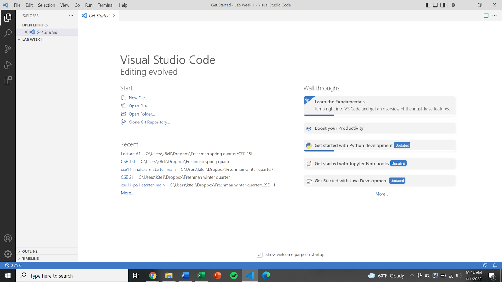
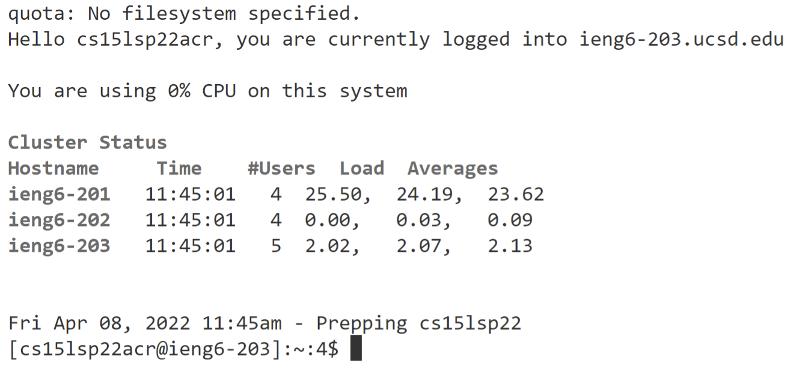
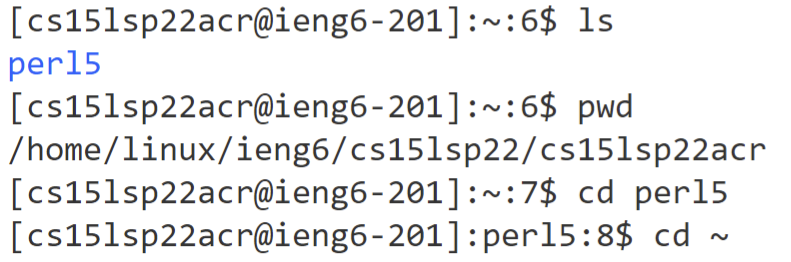
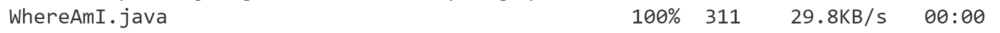
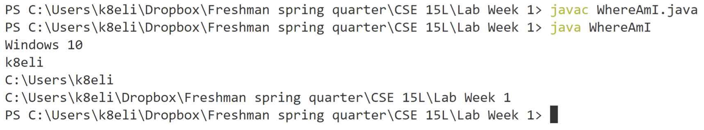
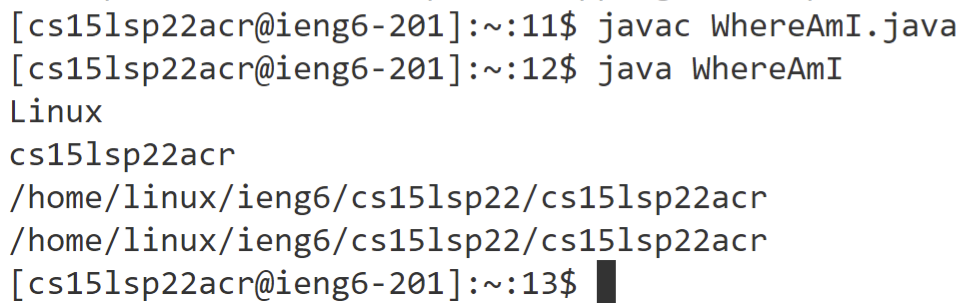
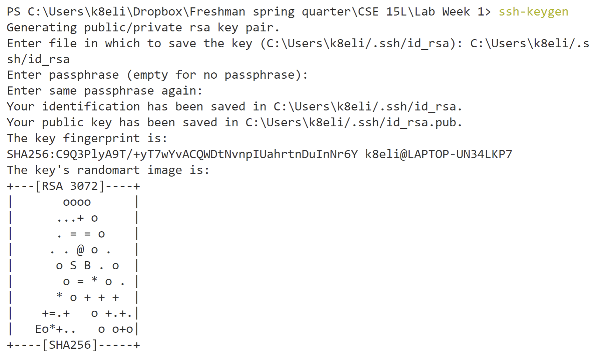
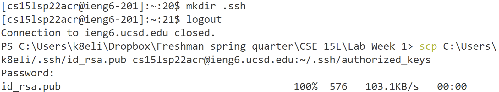
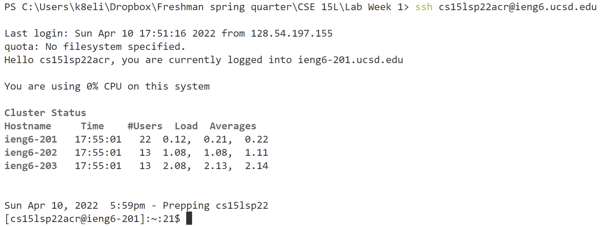
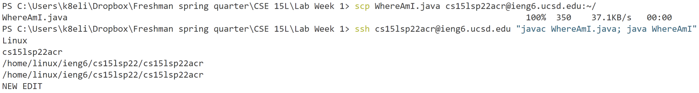

# Lab Report 1

## Installing VScode
First I went to the [VScode Website](https://code.visualstudio.com/) and followed the instructions there to download and install VScode.

After opening VScode, this was the result:



## Remotely Connecting
Next, I used the [UCSD Tech Services Website](https://sdacs.ucsd.edu/~icc/index.php) to lookup my account name for CSE 15L.

Then I opened a new terminal in VScode and used a secure shell to remotely access the ieng6 server (Note: I needed to reset my account password for this to work). To do this, I entered into the terminal:
```
$ ssh cse14lspacr@ieng6.ucsd.edu
```
After prompted, I typed in my password and this was the result:



## Trying Some Commands
Next, I tried entering the following unix commands in the terminal:

* `ls` : List files
* `pwd` :  Print working directory
* `cd` / `cd ~` : Change directory

This was the result:



## Moving Files with `scp`
Next, I created a java file on my computer called WhereAmI.java which outputs the name of the operating system, name of the user, user home, and user directory.
```
class WhereAmI {
  public static void main(String[] args) {
    System.out.println(System.getProperty("os.name"));
    System.out.println(System.getProperty("user.name"));
    System.out.println(System.getProperty("user.home"));
    System.out.println(System.getProperty("user.dir"));
  }
}
```
First, I used the `cd` command to navigate to the directory in which WhereAmI.java is stored. I transfered this file from my computer (the client) to the remote server by entering into the terminal:
```
$ scp WhereAmI.java cs15lsp22acr@ieng6.ucsd.edu:~/
```
After prompted, I typed in my password and this was the result:



After, I was able to compile and run WhereAmI.java on both the client and server.

**Output on the client:**


**Output on the server:**



## Setting an SSH Key
In order to make the process of accessing and copying files onto the server more efficient, I set a SSH key. This creates a pair of files, one on the client computer and one on the server, which allowed me to access and copy files onto the server without typing in my password. 

To do this I created a private key and a public key on the client computer:



Then I copied the public key onto the server:



After, I was able to access the server without entering a password:



## Optimizing Remote Running
Using the methods and changes described above, I was able to optimize the process of editing an remotely running a java file such as WhereAmI.java.

After editing WhereAmI.java, this edit can be copied to the server, compiled, and run six keystrokes. I used the up-arrow twice to recall the first command and pressed enter to copy the updated WhereAmI.java onto the server. Then I again used the up-arrow twice to recall the second command and pressed enter to compile and run the updated WhereAmI.java on the server.

This was the result:


