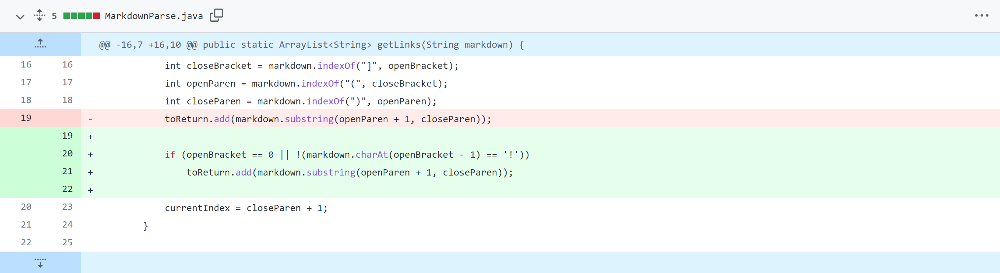
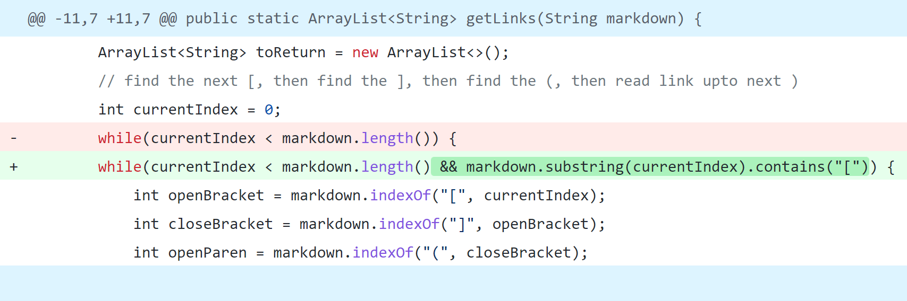
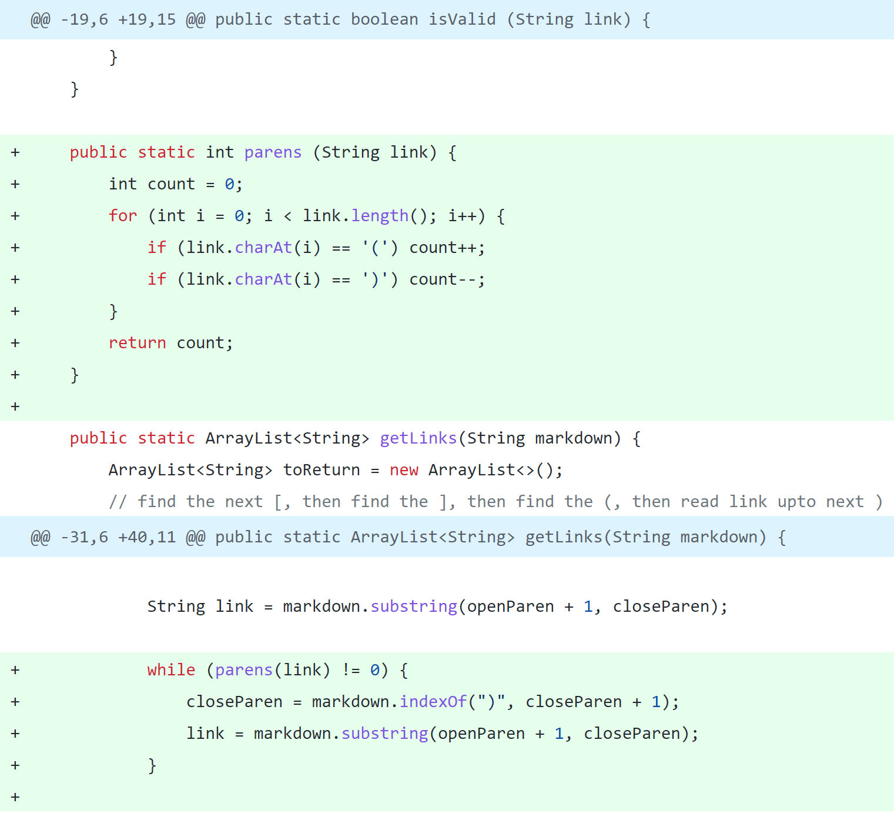

# Lab Report 2

## First Code Change
**Code Change:**



**Failure-Inducing Input:** [Test File](https://raw.githubusercontent.com/k1jackson/markdown-parser/main/test-file-img.md)

**Failure-Inducing Output:** ```[https://something.com, image.PNG]```

**Description:** In this case, the bug is that the code does not differetiate between the syntax for links and images (both of which use brackets followed by parentheses). The failure-inducing input contains both links and images. When running the code with this input, the symptom caused by this bug is that the output contains both links and names of the image files instead of just links.

## Second Code Change
**Code Change:**



**Failure-Inducing Input:** [Test File](https://raw.githubusercontent.com/k1jackson/markdown-parser/main/test-file-paren.md)

**Failure-Inducing Output:** ```Exception in thread "main" java.lang.StringIndexOutOfBoundsException```

**Description:** In this case, the bug is that the code mistakenly assumes that any instance of parentheses is preceded by a set of brackets (like in the syntax for an image or link). Specifically, in line 20 the code assumes any parentheses are preceded by brackets when it checks if the brackets are preceded by a "!". The failure-inducing input contains text with parentheses but no links or images. When running the code with this input, the symptom caused by this bug is that an index out of bounds exception occurs in line 20. 

## Third Code Change
**Code Change:**



**Failure-Inducing Input:** [Test File](https://raw.githubusercontent.com/k1jackson/markdown-parser/main/test-file-paren-link.md)

**Failure-Inducing Output:** Infinite loop (no output)

**Description:** In this case, the bug is that the code assumes that the first instance of a close parenthesis after the open parenthesis at the beggining of the link denotes that end of the link without accounting for possible instances of parenthesis within the link. The failure-inducing input contains links with one or more sets parentheses within them. When running the code with this input, the symptom caused by this bug is an infinite loop (because the condition for the while loop is contingent on the presence of parentheses).