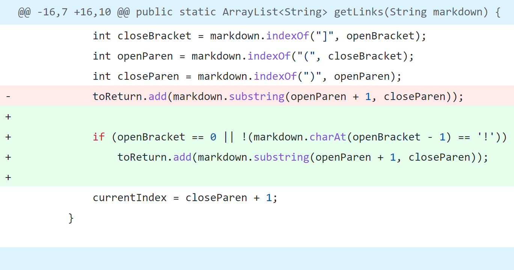

# Lab Report 2

## First Code Change
**Code Change:**



**Failure-Inducing Input:** [Test File](https://raw.githubusercontent.com/k1jackson/markdown-parser/main/test-file-img.md)

**Failure-Inducing Output:** ```[https://something.com, image.PNG]```

**Description:** In this case, the bug is that the code does not differetiate between the syntax for links and images (both of which use brackets followed by parentheses). The failure-inducing input contains both links and images. When running the code with this input, the symptom caused by this bug is that the output contains both links and names of the image files instead of just links.

## Second Code Change

## Third Code Change