# Lab Report 3

## Streamline `ssh` Configuration
**Description:** In this activity I created a config file that indicates what username SSH should use. This allows me to login and copy files to ieng6 without typing my entire username. 

**Edit config file:**

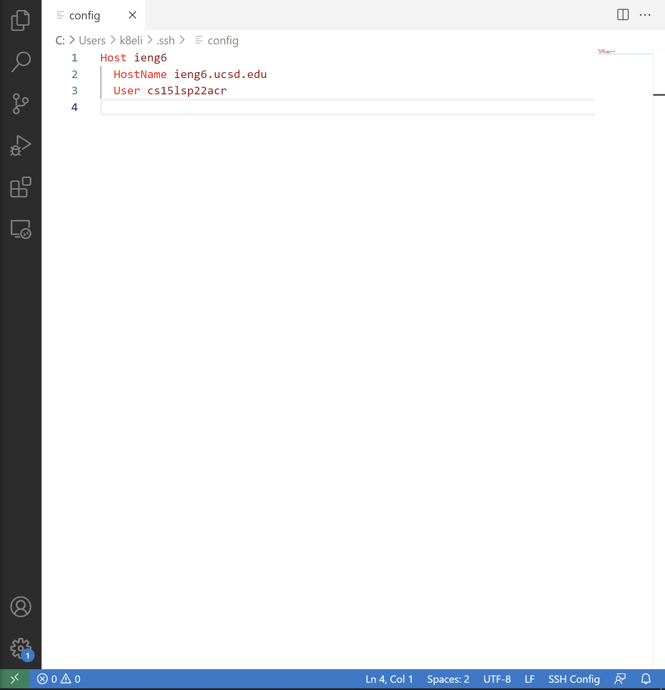

**Login into ieng6 with `ssh`:**

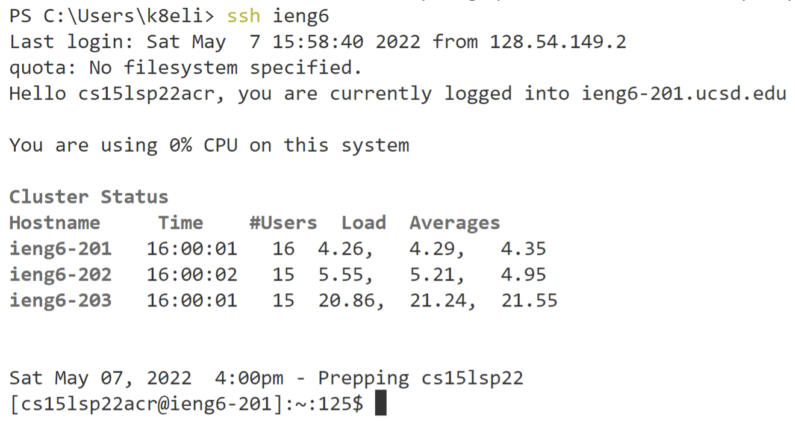

**Copy file onto ieng6 with `scp`:**

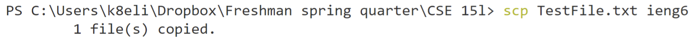

## Setup GitHub Access from ieng6
**Description:** In this activity I created a pair of public and private SSH keys using `ssh-keygen` and stored the public key on GitHub and the pricate key on my user account. This allowed me to commit and push changes from ieng6 without having to authenticate my GitHub password, resulting in an error.

**Public key on GitHub:**

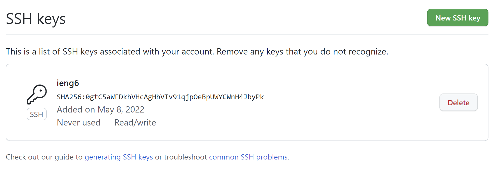

**Private key on user account:**

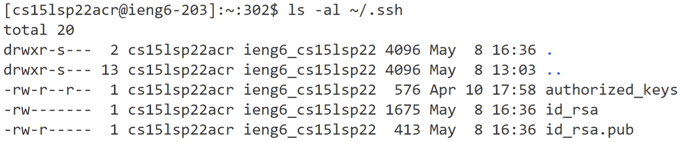

**`git` commands to commit and push a change:**

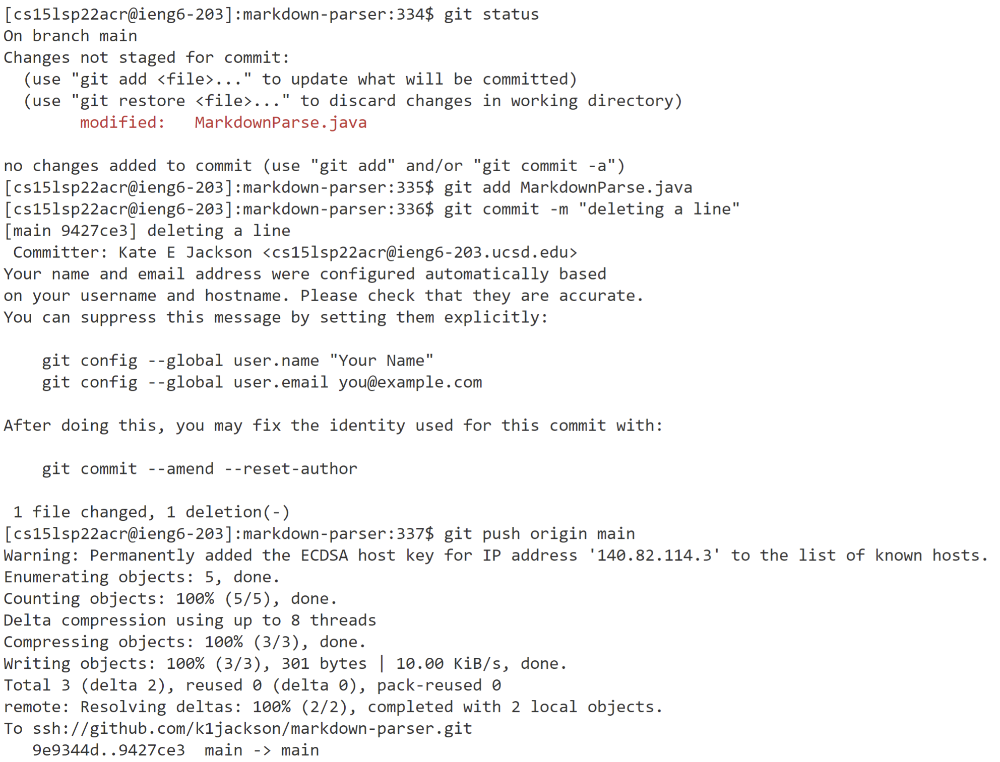

**Link to commit:** [Commit Link](https://github.com/k1jackson/markdown-parser/commit/9427ce3d18c52565426fb536eca6e98d3dd75296)

## Copy Whole Directories with `scp -r`
**Description:** In this activity I used `scp -r` to copy nested directories containing multiple files onto the ieng6 server. I also copied and ran MarkdownParseTest.java in a single command.

**Copy markdown-parse directory to ieng6:**

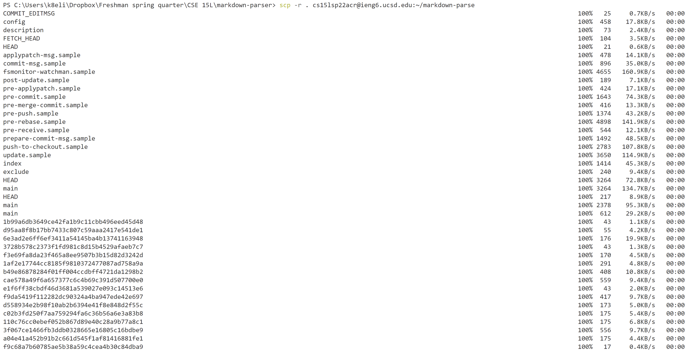
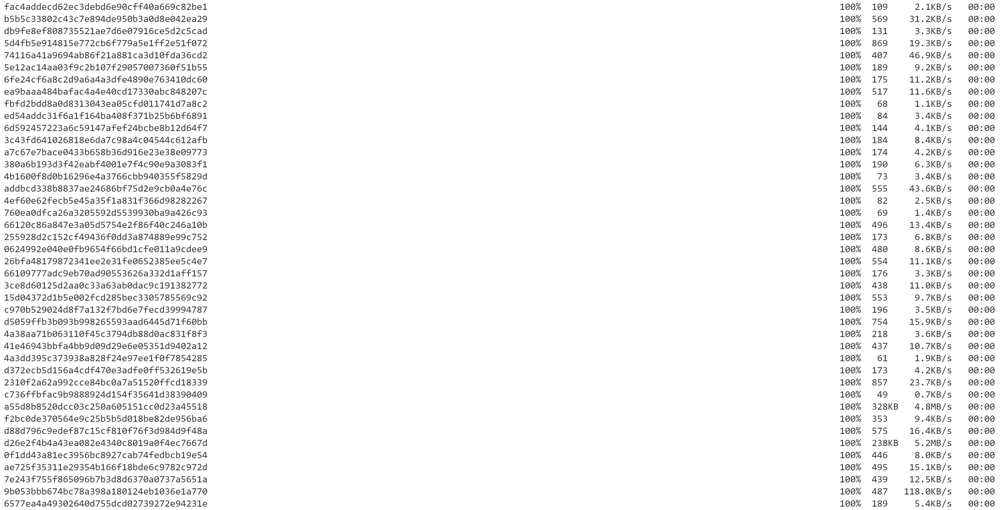
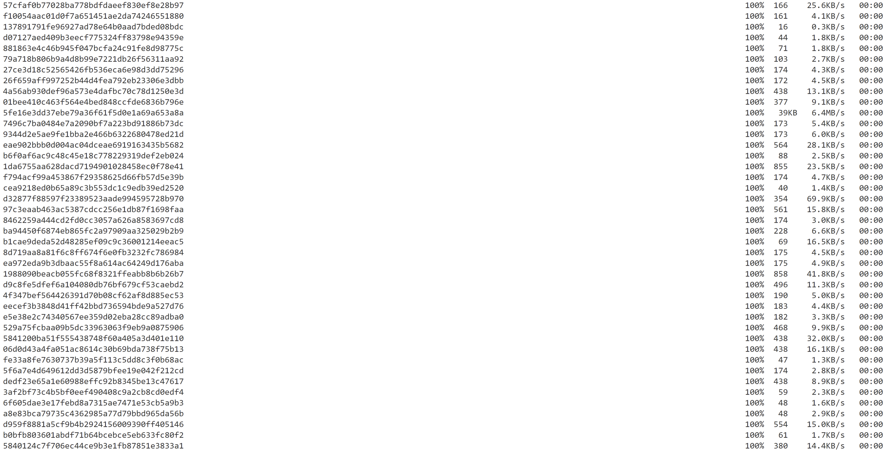
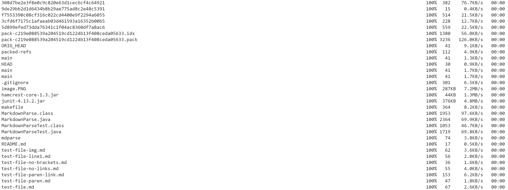

**Login to ieng6 and compile / run tests:**

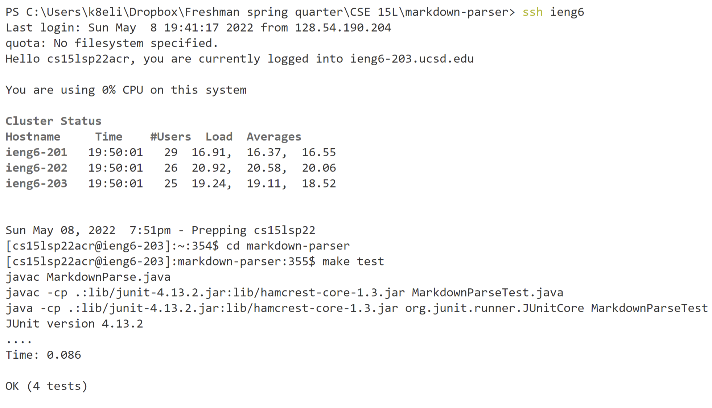

**Combine `scp`, `;`, and `ssh`:**

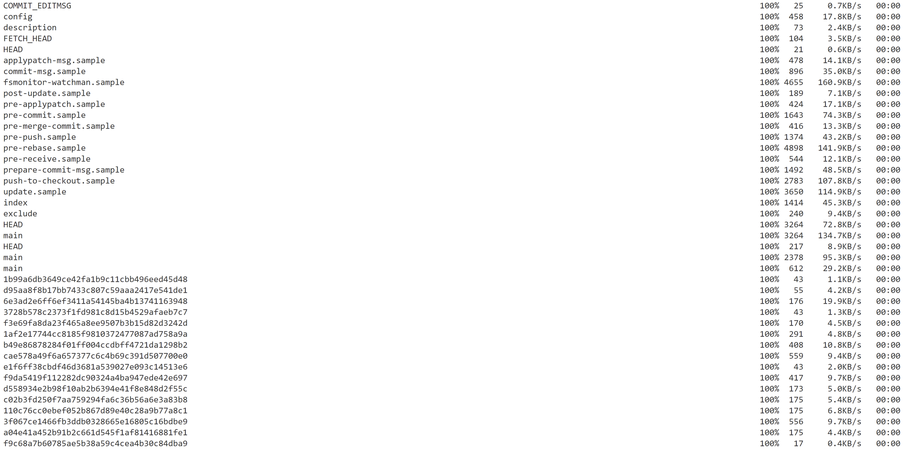

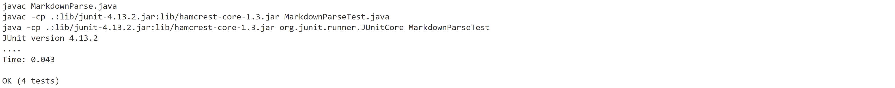