# Lab Report 4

## Repository Links

**My Repository:** [markdown-parser](https://github.com/k1jackson/markdown-parser) \
**Lab 7 Repository:** [markdown-parser](https://github.com/lithicarus/markdown-parser)

## Snippet 1 

|                     | **My Repository** | **Lab 7 Repository** |
|:--------------------|:------------------|:---------------------|
| **Expected Output** | [\`google.com, google.com, ucsd.edu] | [\`google.com, google.com, ucsd.edu] |
|   **Tester Coder**  | 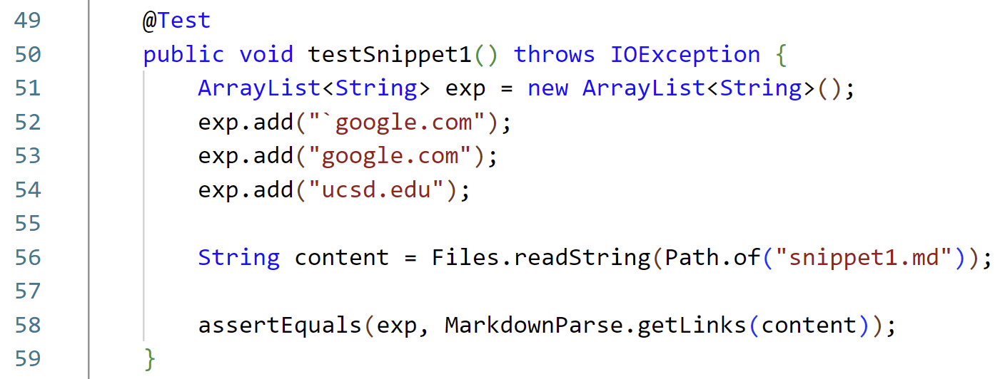 | 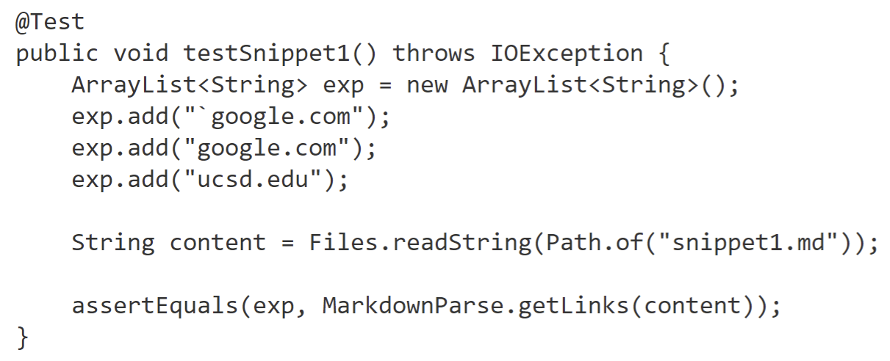 |
|  **Actual Output**  | 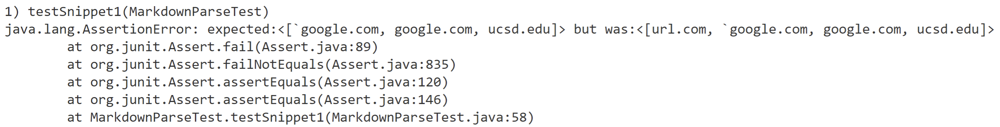 | 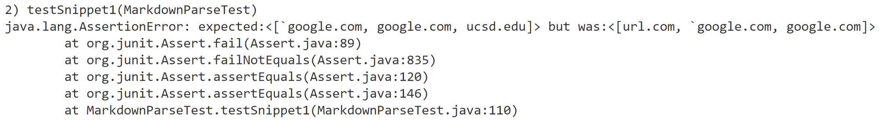 |

**Do you think there is a small (<10 lines) code change that will make your program work?**

Yes, I think I could add a few lines of code such that my program does not consider brackets that appear between two backtick characters. This would prevent my program from mistaking a link for something written in brackets within a section of code.

## Snippet 2

|                     | **My Repository** | **Lab 7 Repository** |
|:--------------------|:------------------|:---------------------|
| **Expected Output** | [a.com, a.com(()), example.com] | [a.com, a.com(()), example.com] |
|   **Tester Coder**  | 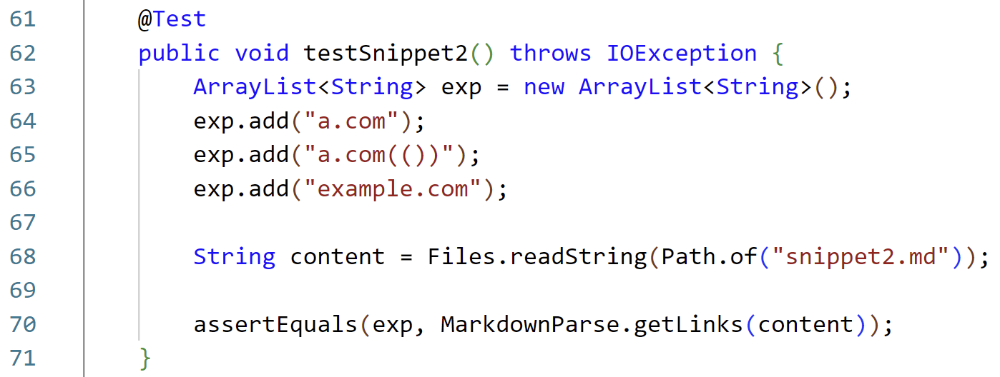 | 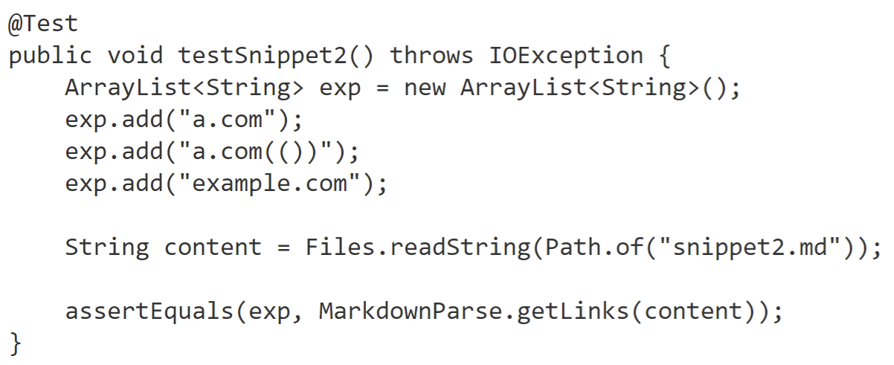 |
|  **Actual Output**  | Test passed! :) | 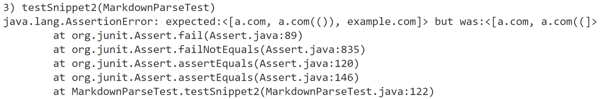 |

**What were the code changes that allowed the tests to pass?**

My code does not consider nested brackets and only looks at a set of parenthesis after any valid set of brackets. As a result, in this case my code happens to correctly identify the three valid links.

## Snippet 3

|                     | **My Repository** | **Lab 7 Repository** |
|:--------------------|:------------------|:---------------------|
| **Expected Output** | [https://www.twitter.com, https://sites.google.com/eng.ucsd.edu/cse-15l-spring-2022/schedule, https://cse.ucsd.edu/] | [https://www.twitter.com, https://sites.google.com/eng.ucsd.edu/cse-15l-spring-2022/schedule, https://cse.ucsd.edu/] |
|   **Tester Coder**  | 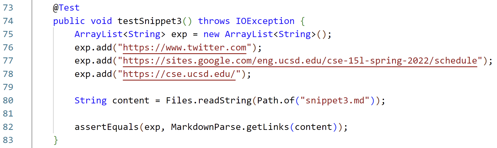 | 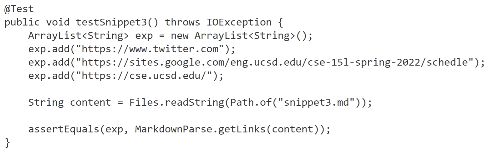 |
|  **Actual Output**  | 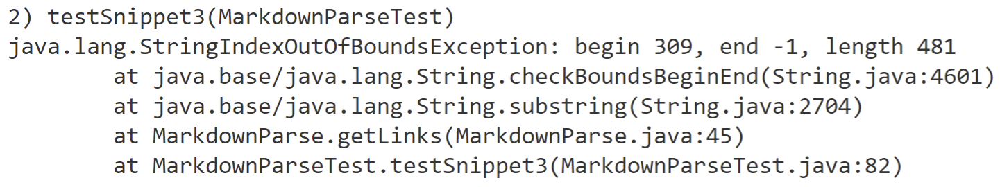 | 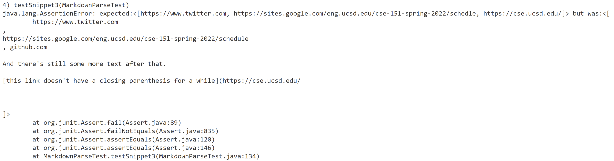 |

**Do you think there is a small (<10 lines) code change that will make your program work?**

Yes, my code is failing because I've added a method which tries to match the number of open and close parenthesis to account for links containing multiple parenthesis. The presense of an open parenthesis without a matching closing parenthesis has resulted in an index out of bounds exception. I think I could add a line to ensure that if there are no more instances of parenthesis, the method will conclude there is no link.

