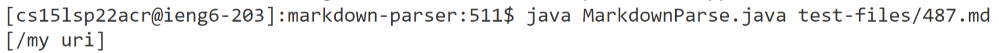
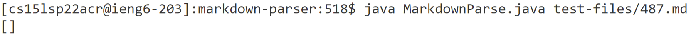
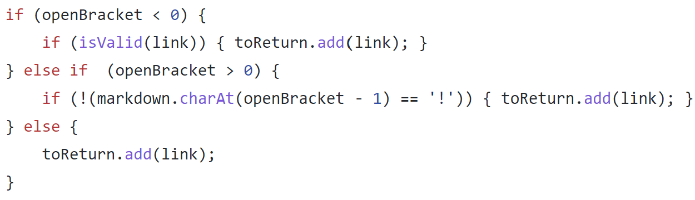
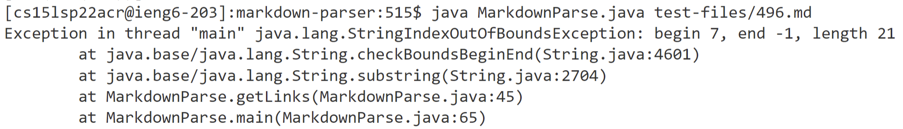
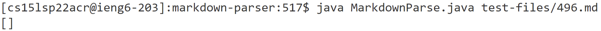
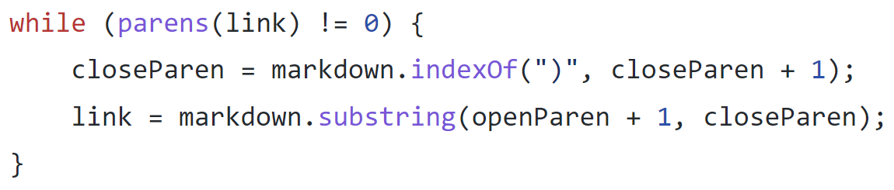

# Lab Report 5

## Finding Different Results

I ran the script.ssh file on both my repository and the repository from lab 9. I copied to results into an excel document to compare them side by side and look for any results that differed.

**Test Files:** \
    **1.** [487.md](https://github.com/nidhidhamnani/markdown-parser/blob/main/test-files/487.md) \
    **2.** [469.md](https://github.com/nidhidhamnani/markdown-parser/blob/main/test-files/496.md)

## Results For 1st Test File (487.md)

**Correct Implementation:** Lab Repository \
**Actual Output (My Repository):**  \
**Actual Output (Lab Repository):**  \
**Expected Output:** `[]` \
**Bug / Fix:** \
The bug in MarkdownParse.java in my repository is that it does not check if a link has spaces and for a link to be valid in markdown it cannot contain spaces. As a result, it mistaking outputs "links" with spaces even though they are not actually valid links in markdown. \

Specifically, in the above block of code where I add the link to my output, I should add a condition which ensures that I do not add links containing spaces. I could check this by using `link.indexOf(" ")`.

## Results For 2nd Test File (496.md)

**Correct Implementation:** Lab Repository \
**Actual Output (My Repository):**  \
**Actual Output (Lab Repository):**  \
**Expected Output:** `[]` \
**Bug / Fix:** \
The bug in MarkdownParse.java in my repository is that my code mistakenly assumes that for every open parenthesis there is a matching closing parenthesis. Because of this, it uses `markdown.indexOf("(")` without checking if the value is less than 0. As a result, when this value is used later in the code, it results in an error because -1 is not a valid index. \

Specifically, in the above block of code, I need to add a line whick checks if `closeParn` has a value less than 0 before it is used as a parameter in `markdown.substring(openParen + 1, closeParn)`. If this happens it means that there is not a closing parenthesis for every open parenthesis an the link is not valid. Therefore, I should add code which breaks from the while loop without adding the link to the output and continues to search for links in the code.